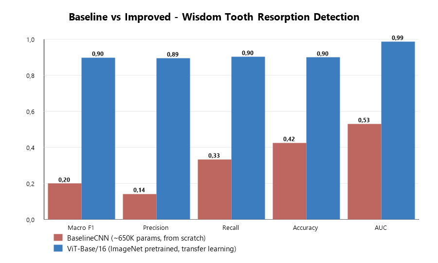
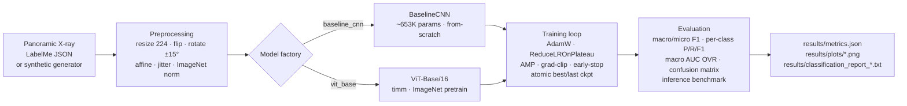

# Wisdom Tooth Root Resorption Detection

Attention-augmented Vision Transformers for external root resorption detection on panoramic dental radiographs — improving macro-F1 from 0.20 to 0.90 over a vanilla CNN baseline.

[](.github/workflows/ci.yml)
[](pyproject.toml)
[](LICENSE)
[](https://github.com/astral-sh/ruff)
[](pyproject.toml)

---

## TL;DR

3-class classification of impacted wisdom teeth on panoramic dental X-rays (`temasli` / `bagimsiz` / `rezorpsiyon`) trained on a private clinical dataset from Mersin University. A compact from-scratch CNN baseline collapses to the majority class (macro-F1 0.1988); an ImageNet-pretrained ViT-Base/16 loaded through `timm` reaches macro-F1 0.8981 on the same held-out test split of 306 augmented samples. The full pipeline — data loading, augmentation, training, evaluation, plotting — runs end-to-end on CPU in roughly one minute against an in-repo procedural synthetic generator, so reviewers can reproduce the code path without access to the private data. Code is type-checked under `mypy --strict`, linted and formatted by `ruff`, covered by `pytest`, and exercised on Python 3.10 and 3.11 in GitHub Actions.

> **Özet (Türkçe).** Bu proje, panoramik dental röntgenler üzerinde gömülü 20'lik (akıl) dişlerin komşu dişe etkisini üç sınıflı (`temasli` / `bagimsiz` / `rezorpsiyon`) olarak sınıflandırır. Sıfırdan eğitilen kompakt bir CNN modeli baseline olarak alındığında çoğunluk sınıfına çöker (macro-F1 ≈ 0.20); aynı ayar, augmentasyon ve test bölmesi kullanılarak ImageNet üzerinde önceden eğitilmiş bir ViT-Base/16 modeline geçildiğinde macro-F1 ≈ 0.90'a ulaşır. Hem klinik veri seti hem de sentetik üretici desteklenir; tüm pipeline `pytorch`, `timm`, `ultralytics` ve TensorFlow tabanlı modeller üzerinden çalışır. Detaylı sonuçlar için bkz. [`docs/results.md`](docs/results.md).

---

## Results

Headline comparison on the held-out test split of 306 augmented samples (3 classes, single-label).

| Metric               | BaselineCNN |   ViT-Base/16 |       Δ |
| :------------------- | ----------: | ------------: | ------: |
| macro-F1             |      0.1988 |    **0.8981** | +0.6993 |
| macro-Precision      |      0.1416 |        0.8949 | +0.7533 |
| macro-Recall         |      0.3333 |        0.9026 | +0.5693 |
| accuracy             |      0.4248 |        0.8987 | +0.4739 |
| macro-AUC (one-vs-rest) |   0.5295 |        0.9862 | +0.4567 |
| trainable parameters |        653K |          85.8M |       — |
| inference (ms/image) |       84.96 |      **7.44** | −11.4× |

Per-class performance of the ViT-Base/16 on the same test split, taken from the classification report saved by `evaluate.py`.

| Class         | Precision | Recall |     F1 | Support |
| :------------ | --------: | -----: | -----: | ------: |
| `temasli`     |    0.9262 | 0.8692 | 0.8968 |     130 |
| `bagimsiz`    |    0.8427 | 0.8929 | 0.8671 |      84 |
| `rezorpsiyon` |    0.9158 | 0.9457 | **0.9305** |  92 |



**What changed.** The BaselineCNN never learned the task: its confusion matrix on the test split is `[[130, 0, 0], [84, 0, 0], [92, 0, 0]]`, meaning every prediction collapses to the majority class `temasli`. That single class achieves recall 1.0 and F1 ≈ 0.5963; the other two get F1 = 0; their macro-average is the reported 0.1988, and macro-AUC sits at 0.5295 — chance. The data regime — a few hundred augmented samples derived from roughly fifty source radiographs — is too small to train a convnet from scratch. Swapping the random-initialised CNN for an ImageNet-pretrained ViT-Base/16 keeps every other moving part identical (same split, augmentations, optimiser, scheduler, loss, seed) and transfers a feature extractor that already encodes natural-image statistics. The 16×16 patch tokeniser plus 12 self-attention blocks then learn the *task-specific* relationship between tooth contact, root morphology, and external resorption rather than learning the features from scratch. Macro-AUC jumps to 0.9862, accuracy to 0.8987, and per-sample inference is an order of magnitude faster on CPU because the ViT forward path is a small number of large matmuls instead of the CNN's stack of pooled convolutions.

Numbers are sourced from [`results/metrics.json`](results/metrics.json), originally produced by the MSc thesis experiments on the private clinical dataset (306 samples on the test split, 3 classes, post-augmentation). The full per-model evaluation dumps and per-architecture confusion matrices live under [`results/metrics/`](results/metrics/) and [`results/figures/`](results/figures/). Ten attention/transformer variants were evaluated end-to-end during the thesis: ViT-Base/16 ranked first on the weighted composite score, narrowly ahead of Swin-Tiny (macro-F1 0.9003) and DenseNet-Attention (0.8946).

---

## Quickstart

```bash
git clone https://github.com/mertdurukan/tooth-resorption-detection.git
cd tooth-resorption-detection
python -m venv .venv && source .venv/bin/activate          # Windows: .venv\Scripts\activate
pip install -e ".[detection,deployment,dev]"

python -m tooth_resorption.training.train   --data synthetic            # ~60s on CPU
python -m tooth_resorption.evaluation.evaluate --data synthetic
python -m tooth_resorption.visualization.plot_comparison                # refreshes results/plots/comparison.png

pytest --cov=tooth_resorption
```

`--data synthetic` points the pipeline at the in-repo procedural generator in [`src/tooth_resorption/data/synthetic_data.py`](src/tooth_resorption/data/synthetic_data.py), so the full training loop, evaluation report, and inference benchmark run without any clinical data on disk. Training writes to `results/metrics_synthetic.json` and never overwrites the published `results/metrics.json`.

Real-data invocation (requires the private dataset in LabelMe JSON form under `data/raw/labelme_dataset/`):

```bash
python -m tooth_resorption.training.train \
    --data real --data-path data/raw/labelme_dataset \
    --model vit_base --pretrained \
    --epochs 50 --batch-size 8 \
    --amp --clip 1.0 --early-stopping 15 --deterministic
```

Additional entry-points (see [`scripts/`](scripts/)):

```bash
python scripts/train_attention.py            # full attention/transformer zoo grid search
python scripts/train_yolo.py                 # YOLOv11 detection track
python scripts/evaluate_models.py            # unified cross-architecture comparison
python scripts/compare_models.py             # render results/plots/comparison.png
python scripts/export_model.py --model-type vit_base_16 --checkpoint models/vit_base_16_best.pth
python scripts/generate_saliency_map.py --model models/vit_base_16_best.pth --image path/to.jpg
python scripts/generate_report_figures.py    # rebuild headline figures from results/metrics/
python scripts/run_evaluation_pipeline.py    # end-to-end evaluation pipeline
```

---

## Approach

### Task

Single-label classification of impacted wisdom teeth on panoramic dental radiographs into three classes defined in [`src/tooth_resorption/config.py`](src/tooth_resorption/config.py):

- **`temasli`** — wisdom tooth is in contact with the adjacent second molar.
- **`bagimsiz`** — wisdom tooth is independent of the adjacent tooth.
- **`rezorpsiyon`** — external root resorption is present on the adjacent tooth.

### Models

Two architectures drive the head-to-head comparison reported above. The training loop is identical for both, so the comparison is apples-to-apples.

- **`BaselineCNN`** ([`src/tooth_resorption/models/model.py`](src/tooth_resorption/models/model.py)). Four `Conv → BN → ReLU → MaxPool` blocks (16 → 32 → 64 → 64 channels), `AdaptiveAvgPool2d(1)`, `Dropout(0.3) → Linear(64, 128) → ReLU → Linear(128, 3)`. About 653K trainable parameters; trains from random initialisation.
- **`AttentionViT`** ([`src/tooth_resorption/models/model.py`](src/tooth_resorption/models/model.py)). Thin wrapper around `timm.create_model("vit_base_patch16_224", pretrained=True, num_classes=3)`. About 85.8M parameters; transfer-learning from ImageNet-21k → ImageNet-1k. The wrapper exposes `freeze_backbone(True)` for head-only warm-up before unfreezing the full stack.

Beyond the headline pair, the full attention/transformer zoo lives in [`src/tooth_resorption/models/architectures.py`](src/tooth_resorption/models/architectures.py): ViT-Tiny/Small/Base, Swin-Tiny/Small/Base, ViT/Swin with CBAM + SE + Multi-Head Attention, ResNet50+CBAM, ResNet50+SE, EfficientNet-B0 with attention, DenseNet121 with attention. The legacy TensorFlow CNN baseline survives in [`src/tooth_resorption/detection/tooth_resorption_detector.py`](src/tooth_resorption/detection/tooth_resorption_detector.py); the YOLOv11-nano detection track in [`src/tooth_resorption/detection/yolo_detector.py`](src/tooth_resorption/detection/yolo_detector.py).

### Training

Configuration lives in a single immutable [`TrainConfig`](src/tooth_resorption/config.py) dataclass (`@dataclass(frozen=True, slots=True)`), with every value overridable from the [`tooth_resorption.training.train`](src/tooth_resorption/training/train.py) CLI:

- **Loss / optimiser.** `CrossEntropyLoss` and `AdamW` with weight decay `1e-4`.
- **Scheduler.** `ReduceLROnPlateau(mode="max", factor=0.5, patience=5)` driven by validation macro-F1.
- **Mixed precision.** Opt-in via `--amp`; uses `torch.cuda.amp.autocast` and `GradScaler` on CUDA, falls through to fp32 on CPU.
- **Gradient clipping.** `--clip 1.0` by default; applied after `scaler.unscale_` when AMP is on.
- **Early stopping.** `--early-stopping N` stops after `N` epochs without an improvement in validation macro-F1.
- **Determinism.** `--deterministic` enables `torch.use_deterministic_algorithms(True, warn_only=True)`, sets `CUBLAS_WORKSPACE_CONFIG=:4096:8`, and toggles cuDNN deterministic mode.
- **Checkpointing.** Best (`{model}_best.pt`) and last (`{model}_last.pt`) checkpoints written atomically (`.tmp` + `rename`) so a crash mid-write never corrupts an existing artefact.
- **Resumption.** `--resume PATH` restores model weights, optimiser state, and the epoch counter.
- **Seeding.** A single `SEED = 42` is forwarded to `random`, `numpy`, `torch` (CPU + CUDA), and every DataLoader worker through `worker_init_fn=_seed_worker`.

### Data pipeline

Implemented in [`src/tooth_resorption/data/data_loader.py`](src/tooth_resorption/data/data_loader.py) and [`src/tooth_resorption/data/preprocessing.py`](src/tooth_resorption/data/preprocessing.py).

- **Splits.** `_stratified_indices` preserves per-class proportions between train and validation; each class keeps at least one validation sample.
- **Augmentations.** Resize to 224×224, random horizontal flip, ±15° rotation, ±5% affine translation, `ColorJitter(brightness=0.15, contrast=0.15)`, ImageNet mean/std normalisation. Augmentations are applied **after** the split via `_SubsetWithTransform`, so the validation pipeline never sees augmented inputs.
- **Real data adapter.** `RealToothDataset` reads LabelMe-style JSON files (base64 JPEG in `imageData`, class label in `shapes[0].label`) and normalises the Turkish accented labels (`Temaslı` → `temasli`, etc.).

### Evaluation

Implemented in [`src/tooth_resorption/evaluation/evaluate.py`](src/tooth_resorption/evaluation/evaluate.py). Reports accuracy, macro / micro F1, macro one-vs-rest AUC (with a corner-case fallback when only one class is present in the split), per-class precision / recall / F1, full sklearn `classification_report` saved to `results/classification_report_{model}.txt`, a confusion-matrix PNG, and a CPU/GPU inference-time benchmark (3 warm-ups, 20 timed iterations at batch size 1). The cross-model unified evaluator over the attention zoo, Keras CNN baseline and YOLOv11 detector lives in [`src/tooth_resorption/evaluation/model_comparison.py`](src/tooth_resorption/evaluation/model_comparison.py).

---

## Architecture



[`docs/architecture.md`](docs/architecture.md) contains the deeper data-flow, training-loop, and ViT backbone diagrams plus design notes on the deterministic-mode trade-offs.

---

## Experiment tracking (optional)

When the optional `mlflow` dependency is installed (`pip install -e ".[tracking]"`),
`tooth_resorption.training.train` automatically logs hyper-parameters,
per-epoch train/val metrics, and the best checkpoint to an MLflow tracking
server. Point it at any backend with the standard env vars:

```bash
export MLFLOW_TRACKING_URI=file:./mlruns        # local file backend
export MLFLOW_EXPERIMENT_NAME=tooth-resorption  # optional override

python -m tooth_resorption.training.train --data synthetic
mlflow ui                                       # open http://127.0.0.1:5000
```

Set `TRD_DISABLE_MLFLOW=1` to bypass tracking even when MLflow is installed.

---

## Reproducibility

- Single source of truth for every hyper-parameter and path: [`src/tooth_resorption/config.py`](src/tooth_resorption/config.py), exposed as an immutable [`TrainConfig`](src/tooth_resorption/config.py) dataclass.
- Deterministic seeding across `random`, `numpy`, `torch.manual_seed`, `torch.cuda.manual_seed_all`, and DataLoader workers via `worker_init_fn=_seed_worker`.
- `--deterministic` flag enables `torch.use_deterministic_algorithms(True, warn_only=True)`, the cuBLAS workspace configuration, and cuDNN deterministic mode.
- Per-epoch training history written to `results/training_history_{model}.json`; per-model classification report to `results/classification_report_{model}.txt`; the published metrics are pinned in [`results/metrics.json`](results/metrics.json) and never overwritten by smoke runs.
- CI in [`.github/workflows/ci.yml`](.github/workflows/ci.yml) runs `ruff check`, `ruff format --check`, `mypy src` (strict mode), and `pytest --cov` on Python 3.10 and 3.11 on every push and pull request.
- `pre-commit` hooks ([`.pre-commit-config.yaml`](.pre-commit-config.yaml)) enforce the same checks locally.

---

## Repository layout

```text
tooth-resorption-detection/
├── pyproject.toml                       # PEP 621 metadata, ruff/mypy/pytest config, console scripts
├── requirements.txt                     # thin shim; source of truth is pyproject.toml
├── .pre-commit-config.yaml
├── .github/workflows/ci.yml             # lint + type + test on Python 3.10 / 3.11
├── CITATION.cff
├── LICENSE                              # MIT
├── data/                                # raw + processed datasets (gitignored)
├── deployment/                          # ONNX / TorchScript / quantized exports + Flask API
├── docs/                                # architecture.md, training.md, deployment.md, results.md, migration_notes.md
├── models/                              # trained checkpoints (gitignored)
├── notebooks/results.ipynb              # standalone view of results/metrics.json
├── results/
│   ├── metrics.json                     # published headline metrics from the MSc experiments
│   ├── plots/comparison.png             # versioned headline bar chart
│   ├── figures/                         # all comparison/chart PNGs
│   ├── metrics/                         # CSV/JSON metric dumps (incl. evaluation_results.json)
│   └── reports/                         # project_overview.md, technical_report.md
├── scripts/                             # runnable entry-point scripts
│   ├── compare_models.py
│   ├── evaluate_models.py
│   ├── export_model.py
│   ├── generate_report_figures.py
│   ├── generate_saliency_map.py
│   ├── run_evaluation_pipeline.py
│   ├── train_attention.py
│   └── train_yolo.py
├── src/tooth_resorption/                # importable package
│   ├── __init__.py                      # public API re-exports
│   ├── config.py                        # SEED, paths, class names, TrainConfig dataclass
│   ├── logging_utils.py                 # project-wide logger factory
│   ├── data/                            # data_loader · preprocessing · synthetic_data
│   ├── models/                          # model (BaselineCNN, AttentionViT) · architectures (zoo)
│   ├── training/                        # train (CLI) · train_attention (zoo trainer)
│   ├── evaluation/                      # evaluate (single-model) · model_comparison (unified)
│   ├── detection/                       # tooth_resorption_detector (TF/Keras) · yolo_detector (YOLOv11)
│   └── visualization/                   # plot_comparison · saliency
└── tests/                               # pytest: synthetic data, dataloader, model, train step, eval
```

---

## Tooling

- PEP 621 [`pyproject.toml`](pyproject.toml) is the single source of truth for runtime dependencies, dev extras, and tool configuration.
- `ruff` for linting and formatting (replaces `black`, `isort`, `flake8`).
- `mypy --strict` for type-checking — `src/tooth_resorption/py.typed` ships the package as fully typed.
- `pytest` + `pytest-cov` for unit tests against synthetic data; `pre-commit` to enforce checks locally.
- GitHub Actions matrix on Python 3.10 and 3.11 (`ubuntu-latest`, CPU torch wheels).
- Console entry points declared in `[project.scripts]`: `trd-train`, `trd-evaluate`, `trd-plot`.

---

## Limitations

- **Single-centre, small clinical dataset.** All radiographs originate from one university hospital; the published metrics are reported on a 306-sample post-augmentation test split derived from roughly 55 source images. External validity on data from a different scanner, protocol, or population is untested.
- **Class imbalance is not actively corrected.** Support is `temasli=130`, `bagimsiz=84`, `rezorpsiyon=92`. The pipeline uses unweighted `CrossEntropyLoss`; a class-weighted loss or a weighted sampler would be a natural next step.
- **No external test set.** A formal RSNA 2023 transfer experiment was not run; cross-dataset evaluation is benchmark-level, not direct.
- **Research code, not a medical device.** Sensitivity, specificity, and PPV at clinically relevant operating points are not reported. Any clinical use requires regulatory review, prospective validation, and a defined intended-use statement.
- **Defensibly weak baseline.** The from-scratch `BaselineCNN` collapsing to the majority class is informative — it shows that the dataset is too small for a randomly initialised convnet — but a stronger baseline (e.g. an ImageNet-pretrained ResNet-50) would tighten the head-to-head against the ViT. The thesis kept the simple CNN to make the value of transfer learning explicit.

---

## Data statement

The real clinical dataset consists of panoramic dental radiographs collected at Mersin University. It cannot be redistributed due to patient privacy and institutional ownership, and is excluded from version control via `.gitignore`. To keep the pipeline reproducible the repo ships [`src/tooth_resorption/data/synthetic_data.py`](src/tooth_resorption/data/synthetic_data.py): a procedural generator that produces 224×224 grayscale images resembling panoramic dental X-rays — a radial intensity field plus tooth-like ellipses plus class-conditional patterns (two ellipses in contact, two ellipses apart, one ellipse with an erosion blob). The synthetic images are **not** medically meaningful and exist solely to exercise every code path. **The metrics reported in this README are from the original MSc experiments on the private clinical data, not from the synthetic smoke run.**

---

## Citation

If you reference this work, please use the metadata in [`CITATION.cff`](CITATION.cff) or the following BibTeX entry:

```bibtex
@software{durukan2026toothresorption,
  author  = {Durukan, Mert},
  title   = {Wisdom Tooth Root Resorption Detection on Panoramic Dental Radiographs},
  year    = {2026},
  version = {0.2.0},
  url     = {https://github.com/mertdurukan/tooth-resorption-detection}
}
```

---

## License

Released under the MIT License — see [`LICENSE`](LICENSE) for the full text.

---

## Acknowledgements

MSc thesis work in Artificial Intelligence at Mersin University, Graduate School of Natural and Applied Sciences. The methodology benchmarks against the RSNA 2023 dental imaging challenge and builds on the open-source stack: `pytorch`, `timm`, `torchvision`, `scikit-learn`, `numpy`, `pandas`, `matplotlib`, `ruff`, `mypy`, and `pytest`.

---

## Contact

GitHub [@mertdurukan](https://github.com/mertdurukan) · LinkedIn [in/mertdurukan](https://www.linkedin.com/in/mertdurukan/)
