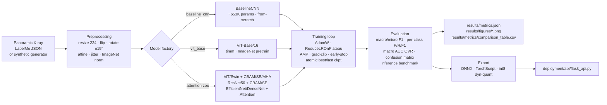

# Architecture

## Repository layout

```
tooth-resorption-detection/
├── .github/workflows/ci.yml          # ruff + mypy + pytest on push / PR
├── data/
│   ├── raw/                          # LabelMe JPG+JSON pairs (gitignored)
│   ├── processed/                    # Derived YOLO dataset (gitignored)
│   └── README.md
├── deployment/
│   ├── api/                          # Flask inference API
│   ├── onnx/                         # ONNX exports (gitignored)
│   ├── torchscript/                  # TorchScript exports (gitignored)
│   ├── quantized/                    # int8 dynamic-quant exports (gitignored)
│   └── model_metadata.json
├── docs/
│   ├── architecture.md               # this file
│   ├── training.md
│   ├── deployment.md
│   ├── results.md
│   └── migration_notes.md
├── models/                           # Trained checkpoints (gitignored)
├── notebooks/
│   └── results.ipynb                 # Outputs cleared
├── results/
│   ├── figures/                      # All comparison/chart PNGs
│   ├── metrics/                      # CSV/JSON metric exports
│   ├── reports/                      # Markdown reports (project_overview, technical_report)
│   ├── plots/comparison.png          # Headline baseline-vs-improved chart
│   └── metrics.json                  # Published headline numbers (versioned)
├── scripts/                          # Runnable entry-point scripts
│   ├── compare_models.py
│   ├── evaluate_models.py
│   ├── export_model.py
│   ├── generate_report_figures.py
│   ├── generate_saliency_map.py
│   ├── run_evaluation_pipeline.py
│   ├── train_attention.py
│   └── train_yolo.py
├── src/tooth_resorption/             # Importable package
│   ├── __init__.py                   # Public re-exports
│   ├── config.py                     # Paths, class names, TrainConfig dataclass
│   ├── logging_utils.py              # get_logger factory
│   ├── py.typed                      # PEP 561 marker
│   ├── data/                         # Datasets, augmentations, synthetic generator
│   ├── models/                       # BaselineCNN + ViT + the full attention zoo
│   ├── training/                     # Standard trainer + attention-zoo trainer
│   ├── evaluation/                   # Single-model and unified cross-model evaluators
│   ├── detection/                    # Keras CNN baseline + YOLOv11 wrapper
│   └── visualization/                # Plot comparison + saliency maps
├── tests/                            # Pytest suite (synthetic-data smoke tests)
├── .gitignore
├── .pre-commit-config.yaml
├── .python-version
├── CITATION.cff
├── CONTRIBUTING.md
├── LICENSE
├── pyproject.toml
├── README.md
└── requirements.txt
```

## Package design

The runtime code lives in `src/tooth_resorption/` and is installed in
editable mode by `pip install -e .`. Setuptools is configured (see
`pyproject.toml`) with `package-dir = { "" = "src" }`, so the package is
imported as `tooth_resorption`, never as `src` or `src.tooth_resorption`.

### Submodule responsibilities

| Submodule                     | Responsibility                                                                                                                              |
| :---------------------------- | :------------------------------------------------------------------------------------------------------------------------------------------ |
| `config`                      | All paths, class names, image size, normalisation constants, `TrainConfig` dataclass. Single source of truth for hyper-parameters.          |
| `logging_utils`               | `get_logger(name)` — every other module calls this so logging stays consistent and the `TRD_LOG_LEVEL` env var works everywhere.            |
| `data.preprocessing`          | torchvision `Compose` builders for training / validation transforms.                                                                        |
| `data.synthetic_data`         | Procedural dental-X-ray generator. Deterministic given a seed.                                                                              |
| `data.data_loader`            | `SyntheticToothDataset`, `RealToothDataset` (LabelMe JSON), stratified split helper, seeded `DataLoader` factory.                            |
| `models.model`                | `BaselineCNN`, `AttentionViT`, `build_model` factory for the headline comparison.                                                            |
| `models.architectures`        | Full attention/transformer zoo: ViT, Swin, ResNet+CBAM, ResNet+SE, EfficientNet-Attention, DenseNet-Attention, ViT/Swin + attention variants. |
| `training.train`              | Main trainer for the BaselineCNN / ViT comparison. AMP, grad-clip, early stopping, resume, atomic checkpoint writes.                         |
| `training.train_attention`    | Grid-search trainer for the attention zoo. Two-stage fine-tuning (head warm-up → unfreeze) + per-model JSON logs.                            |
| `evaluation.evaluate`         | Single-model evaluator (matches the headline `comparison.png` setup).                                                                       |
| `evaluation.model_comparison` | `UnifiedModelEvaluator` — evaluates Keras CNN, PyTorch attention zoo and YOLO models against the same dataset and emits one comparison CSV. |
| `detection.tooth_resorption_detector` | Keras CNN baseline (preserved for reproducibility).                                                                                  |
| `detection.yolo_detector`     | YOLOv11-nano wrapper: dataset preparation, train, eval, predict.                                                                            |
| `visualization.plot_comparison` | Render the baseline-vs-improved bar chart from `results/metrics.json`.                                                                    |
| `visualization.saliency`      | Input-gradient saliency maps + jet-colormap overlays.                                                                                       |

### Entry-point scripts

Runnable scripts under `scripts/` are thin wrappers over the public API of
the package — they parse CLI arguments and call into `tooth_resorption.*`.
Keep heavy logic in the package; keep CLIs in `scripts/`.

## Data flow



## Migration decisions

This layout was reached by consolidating the legacy `yontem_deneme/` folder
into the existing `src/` package. The full migration log lives in
[`docs/migration_notes.md`](migration_notes.md), but the highlights are:

- The flat `src/` Python module was promoted to a real importable package
  under `src/tooth_resorption/` with topical subpackages (`data/`,
  `models/`, `training/`, `evaluation/`, `detection/`, `visualization/`).
- The Turkish dataset folder `20 lik diş rezorpsiyon/` was renamed to the
  ASCII path `data/raw/labelme_dataset/` and is git-ignored.
- The TensorFlow CNN baseline and the YOLOv11 detector survived the
  migration as first-class modules under `detection/` — both are kept so
  the cross-architecture comparison reported in the technical report stays
  reproducible.
- Every Turkish identifier in production code was translated to English
  snake_case (`egitim` → `training`, `dogruluk` → `accuracy`, etc.). The
  three class identifiers `temasli` / `bagimsiz` / `rezorpsiyon` are
  preserved because they are domain labels embedded in the dataset itself.
